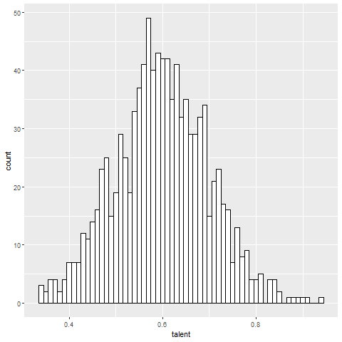
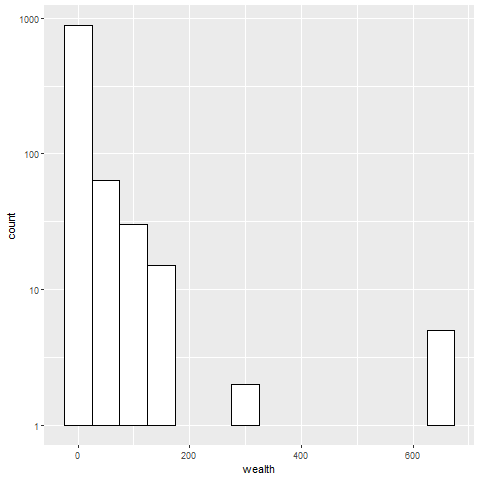
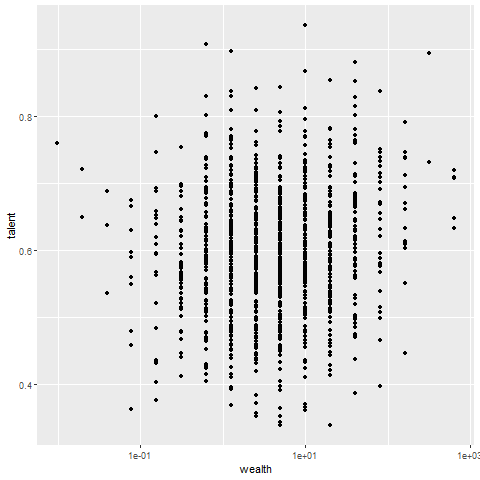
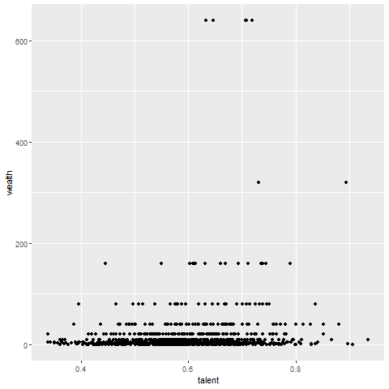
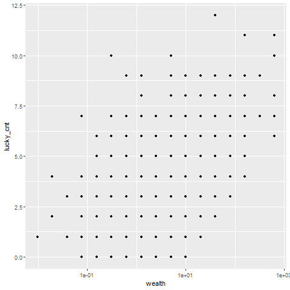
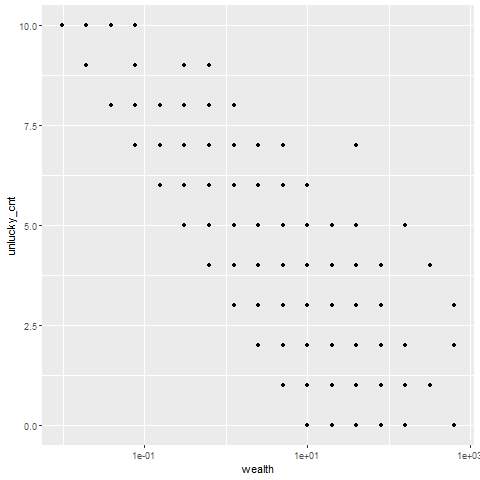
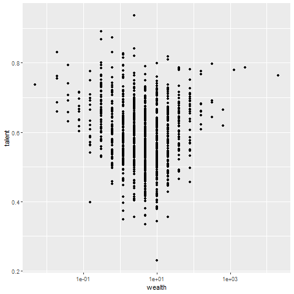
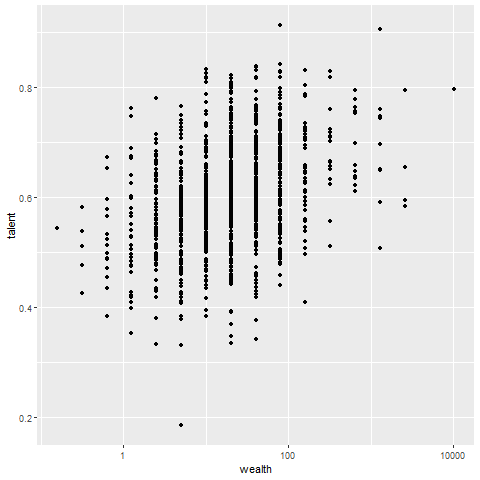
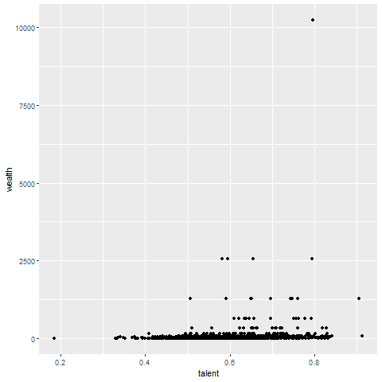

# LvTSimulator
 Replicate the simulation of the 2022 Ig Nobel Prize in Economics winning paper!

The award was given "for explaining, mathematically, why success most often goes not to the most talented people, but instead to the luckiest" (Improbable Research, 2022). The paper runs numerical simulations of the so-called "Talent vs. Luck" debate and says that luck is more important than talent.

It simulates the following conditions (Pluchino et al., 2018).

+ Simulated a world in which 1000 people encounter 500 events
+ Talent is given a normal distribution between 0 and 1
+ Assets that imply success, starting equally at 10
+ 80 iterations with ages ranging from 20 to 60
+ The events they encounter have a 50-50 chance of being lucky or unlucky
+ Lucky events can be won according to talent and double assets
+ Unlucky events are applied regardless of talent, and assets are halved

The simulation results are as follows
+ Success replicates the power law, especially Pareto's law(the top 20% have 80% of the wealth).
+ Success was achieved by those who had the highest number of lucky events, not those who were the most talented.

The second half of the paper suggests that a uniform subsidy is more efficient than a talent-based subsidy in correcting the good luck gap.

This source reproduced the results of this paper in Python and R, and then performed the following two additional verifications.

+ Isn't the sociability of being able to encounter events also a talent? What are the results in the model where talented people encounter more events?　(SociableHuman model)
+ Is the ability to encounter unfortunate events without reducing one's assets also a talent? What would be the result in a model where talent would allow a person to avoid a halving of assets? (PreventiveHuman model)

This code took a simpler approach than in the paper but was able to reproduce almost similar results. In particular, encounters with events use a Poisson distribution with a lambda value of around 0.5. In the csv data under the sample folder, the top 20% accounted for 79.9% of the wealth.

The normal distribution of talent: Graph 1; the power distribution of assets: Graph 2; Graphs 3 and 4 show the weak correlation between talent and wealth; Graphs 5 and 6 show the strong correlation between luck and wealth.

|| Top 20% have | Glaph 1 | Glaph 2 | 
|:---:|:---:|:---:|:---:|
|Model 1|79.9%| | |

| Glaph 3 | Glaph 4 | Glaph 5 | Glaph 6 |
|:---:|:---:|:---:|:---:|
| || | |

in the <b>SociableHuman model</b>, the luck advantage did not change. The disparity would be larger than in reality and may be inappropriate for the model. Graph 7 shows the distribution in this model where the higher the talent, the greater or smaller the wealth.

|| Top 20% have | Glaph 7 |
|:---:|:---:|:---:|
|Model 2|91.1%||

The <b>PreventiveHuman model</b> reproduced Pareto's Law and showed results in which talent contributed more to success. Graphs 8 and 9 show a distribution where talent is more meaningful.

|| Top 20% have | Glaph 8 | Glaph 9 |
|:---:|:---:|:---:|:---:|
|Model 3|81.7%|||

After all, talent is not irrelevant depending on the model applied.

<b>Reference:</b>  
Improbable Research.(2022). <i>Ignobel Prize Winners|2022</i>. https://improbable.com/ig/winners/#ig2022  
Pluchino, A., Biondo, A. E., & Rapisarda, A.(2018). Talent vs. Luck: The Role of Randomness in Success and Failure. <i>Advances in Complex Systems, 21[3,4]</i>. https://doi.org/10.1142/S0219525918500145